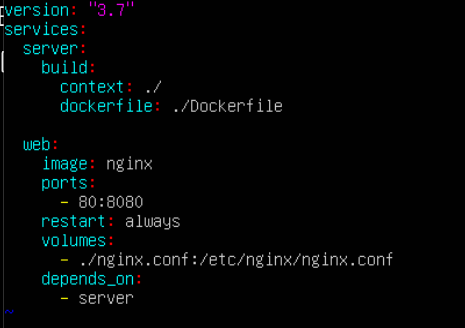

# Simple Docker

## Part 1. Ready docker

- Take the official docker-image from **nginx** and download his with `docker pull`
```
sudo docker pull nginx
```


- Check for a docker-image via `docker images`
```
sudo docker images
```


- Launch the docker-image via `docker run -d [image_id|repository]`
```
sudo docker run -d 021283c8eb95
```


- Check for a docker-image launched
```
sudo docker ps
```


- Watch info about container
```
sudo docker inspect bb8b08471fce
```


- By the output command define and place it in the report:
	- container size
	
	
	
	- lists of mapped ports
	
	
	
	- container ip
	
	

- Stop the docker-image
```
sudo docker stop bb8b08471fce
```


- Check for a docker-image stopped
```
sudo docker ps
```


- Launch the docker with 80 and 443 port in container, which mapped on there ports on a local machine, via *run*
```
sudo docker run -d -p 80:80 -p 443:443 021283c8eb95
```


- Check that the start page **nginx** is available in browser at *localhost:80*
```
curl localhost:80
```


- Restart docker via `docker restart [container_id|container_name]`

- Check in any way that the container was started on the local machine, using command *run*
```
STATUS Up 2 seconds
```


## Part 2. Container operations 

- Read config file *nginx.conf* inside the docker container via *exec*
```
sudo docker exec 93906bf9857a cat /etc/nginx/nginx.conf
```


- Create file on the local machine *nginx.conf*
```
mkdir nginx
```
```
sudo docker exec 93906bf9857a cat /etc/nginx/nginx.conf > /home/student/nginx/nginx.conf
```
```
cat nginx/nginx.conf
```


- Configure it along the path */status* return of the server status page **nginx**


- Copy created file *nginx.conf* inside the docker-image via `docker cp`
```
sudo docker cp nginx.conf 93906bf9857a:/etc/nginx/
```


- Restart **nginx** inside the docker-image via *exec*
```
sudo docker exec 93906bf9857a nginx -s reload
```


- Check that at *localhost:80/status* given page with server status **nginx**
```
curl localhost:80/status
```


- Export container in the *container.tar* file via *export*
```
sudo docker export 93906bf9857a > container.tar
```


- Stop container
```
sudo docker stop 93906bf9857a
```


- Delete image via `docker rmi [image_id|repository]`, without removing the containers before that
```
sudo docker rmi -f 021283c8eb95
```


- Delete stopped container 
```
sudo docker rm 93906bf9857a
```


- Import container back via *import*
```
sudo docker import -c 'CMD ["nginx", "-g", "daemon off;"]' container.tar
```


- Start imported container
```
sudo docker images
```


- Check that at *localhost:80/status* given page with server status **nginx**
```
curl localhost:80/status
```


## Part 3. Mini web-server

- Write mini-server on **C** and **FastCgi**, which will return simple page with `Hello World!`
 

- Start written mini-server via *spawn-fcgi* on 8080 port
```
sudo docker run -d -p 81:81 --name task3 021283c8eb95
```

 \
```
sudo docker cp main.c task3:home/
```

 \
```
sudo docker exec -it task3 bash
```

 \
```
gcc /home/main.c -lfcgi -o server
```

 

- Write your *nginx.conf*, which will proxy all request with 81 port on *127.0.0.1:8080*
 

- Check that in browser on *localhost:81* given written urself page
 

- Put *nginx.conf* file on the way *./nginx/nginx.conf* (that will need later)
```
sudo docker cp nginx.conf task3:/etc/nginx/
```

 


## Part 4. Your docker

- Write your docker-image, which:
	1) Collect sources mini-server on FastCgi from Part 3
	2) Start him on 8080 port
	3) Copy inside image written *./nginx/nginx.conf*
	4) Start **nginx**.
  - Dockerfile:
  
  	
  	
  - script.sh:
  
  	
  	
- Collect written docker-image via `docker build` at the same time specifyin the name and tag
```
 sudo docker build -f part_4/Dockerfile -t part_4:1.0 
```
 
- Check via `docker images`, that everything collect correct 


- Start assembled docker-image with 81 mapping and 80 port on local machine and mapping folder *./nginx* inside container on address, when lay configure **nginx** files
```
sudo docker run -d -p 80:81 -v /home/student/nginx/nginx.conf:/etc/nginx/nginx.conf --name container part_4:1.0
```


- Check that on localhost:80 available the page written mini-server


- Finish writting in *./nginx/nginx.conf* page proxying */status*, on which to give **nginx** server status 


- Restart docker-image
```
 sudo docker restart container
```
```
 sudo docker exec container cat /etc/nginx/nginx.conf
```


- Check that what now on the *localhost:80/status* given page with **nginx** status 


## Part 5. **Dockle**

- Download Dockle
- Created install_dockle.sh, which contains inside next code:
```
#!/bin/bash

VERSION=$(
curl --silent "https://api.github.com/repos/goodwithtech/dockle/releases/latest" | \
grep '"tag_name":' | \
sed -E 's/.*"v([^"]+)".*/\1/' \
) && curl -L -o dockle.deb https://github.com/goodwithtech/dockle/releases/download/v${VERSION}/dockle_${VERSION}_Linux-64bit.deb
```

- and then ill use this command:
```
sudo dpkg -i dockle.deb && rm dockle.deb
```

- Scan image from lastest task via `dockle [image_id|repository]`


- Fix image so that on check via **dockle** there are no errors

 \


## Part 6. Базовый **Docker Compose**

- Download docker-compose
```
sudo curl -L "https://github.com/docker/compose/releases/download/1.26.0/docker-compose-$(uname -s)-$(uname -m)" -o /usr/local/bin/docker-compose
sudo chmod +x /usr/local/bin/docker-compose
docker-compose --version
```

- Write *docker-compose.yml* file, with the help of:
    1) Raise docker container for Part 5 _(he is should work in local network, that is dont need using instruction **EXPOSE** and mapping ports on the local machine)_
    
	1.1) Mapping 8080 port second container on the 80 port local machine

	
    
    2) Raise docker container with **nginx**, which will proxying all request from 8080 port on the 81 port first container

	

- Collect and start project with commands `docker-compose build` and `docker-compose up`

 \


- Check that in browser on the *localhost:80* given written urself page, like later 


